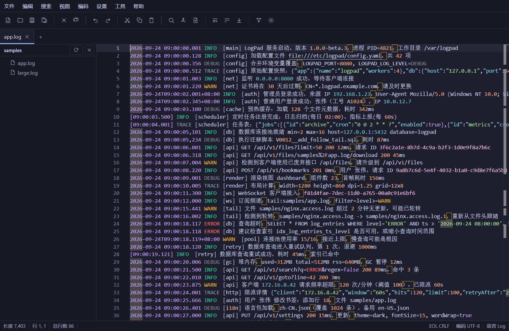
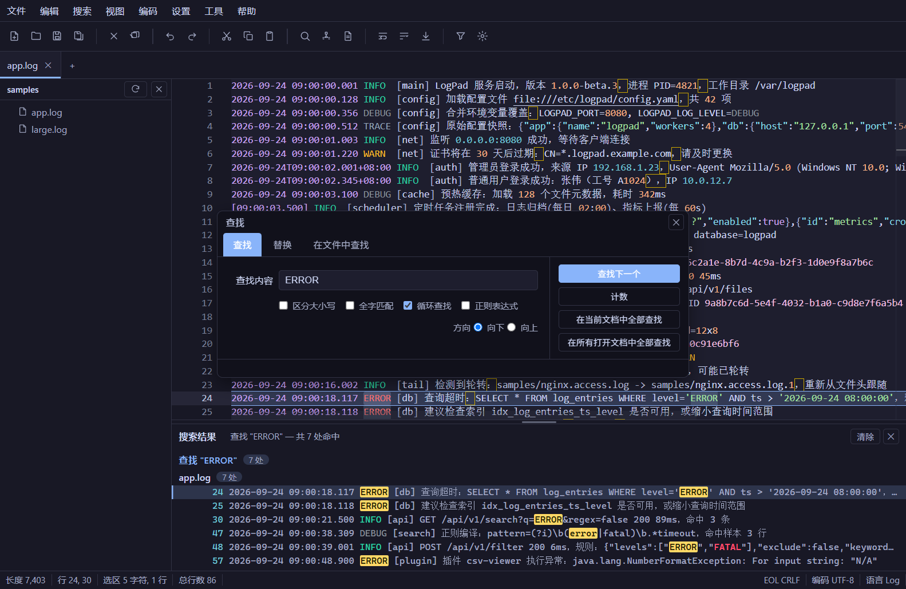

# LogPad

**English:** LogPad is a Notepad++-style, cross-platform log viewer built with Electron and the Monaco editor. It opens huge log files instantly, highlights log levels, and reproduces the Notepad++ search workflow — including Find in Files across a whole folder — on both Windows and Linux.

**中文：** LogPad 是一个 Notepad++ 风格的跨平台日志查看器，基于 Electron + Monaco Editor 构建，支持 Windows 与 Linux。针对日志阅读场景优化：超大文件秒开、日志级别着色与过滤、tail 跟随，并完整复刻 Notepad++ 的查找/替换/文件夹搜索工作流。

## 界面截图

> 截图待补充：运行应用截图后保存到 `docs/screenshots/` 目录，取消下方注释引用即可展示。
>
> <!--  -->
> <!--  -->
> <!--  -->

## 功能特性

### 阅读与编辑
- **多标签编辑**：基于 Monaco，会话自动恢复（重开应用还原标签页）
- **大文件模式**：超大文件自动切换（实测 100MB 日志约 100ms 打开）
- **多编码支持**：UTF-8 / UTF-8 (BOM) / GBK / UTF-16 LE / UTF-16 BE，可按编码重载或转换保存
- **日志级别着色**：ERROR / WARN / INFO 等级别高亮（Monarch 语法着色）
- **日志级别过滤**：按级别与关键字过滤显示
- **Tail 跟随**：类似 `tail -f`，自动滚动到新增内容
- **外部修改自动重载**：文件被其他程序修改后自动提示重载
- **书签**：行书签标记与快速跳转

### 搜索（Notepad++ 工作流）
- **查找 / 替换 / 在文件中查找**：三合一对话框（Ctrl+F / Ctrl+H / Ctrl+Shift+F），布局与 Notepad++ 一致
- **底部搜索结果面板**：命中列表点击跳转、级别着色、可拖动调整高度
- **文件夹搜索**：全目录递归搜索，支持通配符过滤，结果按文件分组
- **搜索结果区可选中复制**：鼠标任意选区直接复制

### 工作区
- 文件夹即工作区：左侧目录树展示，支持展开/折叠/刷新/复制路径
- 右键菜单：**在此文件夹中查找**（与 Notepad++ 一致）
- 拖放：拖入**文件**直接开新标签，拖入**文件夹**设为工作区
- 系统集成：右键"打开方式"选择 LogPad 可直接打开文件（单实例转交）

### 外观
- 双主题：LogVue Dark / LogVue Light
- 自动换行开关（正文与搜索结果面板同步联动）
- 显示选项：空白字符 / 行尾符 / 行号，全部持久化
- 缩放：Ctrl+滚轮（10–40px），状态栏百分比显示

## 安装

从 [Releases](https://github.com/andan-whl/logpad/releases) 页面下载对应平台安装包：

| 平台 | 产物 | 说明 |
|---|---|---|
| Windows | `LogPad-Setup-0.1.0.exe` | NSIS 安装版 |
| Windows | `LogPad-Portable-0.1.0.exe` | 便携版，免安装 |
| Linux | `logpad_0.1.0_amd64.deb` | `sudo dpkg -i` 安装 |
| Linux | `logpad-0.1.0.tar.gz` | 解压后直接运行 |

## 从源码构建

环境要求：Node.js 18+（Windows 下打包 Linux 产物无需 WSL，AppImage 除外）。

```bash
npm install          # 安装依赖
npm run dev          # 开发模式运行
npm run dist:win     # Windows：NSIS Setup + Portable
npm run dist:linux   # Linux：tar.gz + deb（含 24 项打包断言校验）
```

## 快捷键

| 分类 | 快捷键 | 功能 |
|---|---|---|
| 文件 | `Ctrl+N` / `Ctrl+O` | 新建 / 打开（文件或文件夹） |
| 文件 | `Ctrl+S` / `Ctrl+Shift+S` | 保存 / 另存为 |
| 文件 | `Ctrl+W` / `Ctrl+Shift+W` | 关闭标签 / 关闭全部 |
| 标签 | `Ctrl+Tab` / `Ctrl+Shift+Tab` | 下一个 / 上一个标签 |
| 搜索 | `Ctrl+F` / `Ctrl+H` / `Ctrl+Shift+F` | 查找 / 替换 / 在文件中查找 |
| 搜索 | `F3` / `Shift+F3` / `Ctrl+F3` | 下一个 / 上一个 / 查找选中内容 |
| 编辑 | `Ctrl+D` / `Ctrl+L` | 复制当前行 / 删除当前行 |
| 编辑 | `Ctrl+Shift+↑` / `Ctrl+Shift+↓` | 上移 / 下移当前行 |
| 导航 | `Ctrl+G` | 跳转到行 |
| 书签 | `Ctrl+F2` / `F2` / `Shift+F2` | 切换书签 / 下一书签 / 上一书签 |
| 过滤 | `Ctrl+Shift+L` | 级别过滤面板 |
| 跟随 | `Ctrl+Alt+T` | tail 跟随开关 |
| 视图 | `Ctrl+滚轮` / `Ctrl+小键盘 + − 0` | 缩放 / 重置缩放 |
| 视图 | `F11` | 全屏 |

## 项目结构

```
src/main        主进程：窗口管理、IPC、文件 IO、后台搜索、编码检测、持久化
src/preload     预加载：contextBridge 安全桥接（白名单频道）
src/renderer    渲染层：Monaco + 按功能划分的模块（tabs/search/workspace 等 14 个）
scripts        构建与校验：deb 打包（24 项断言）、主进程静态校验（33 项断言）
samples        示例日志
```
